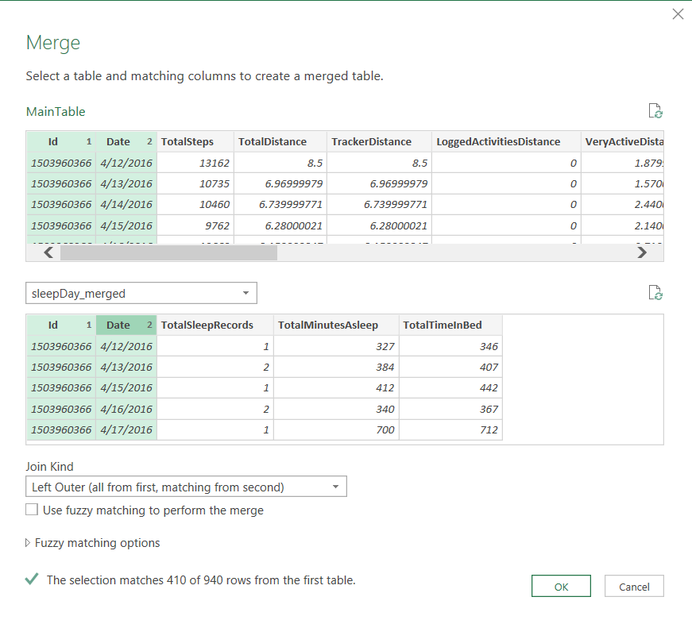
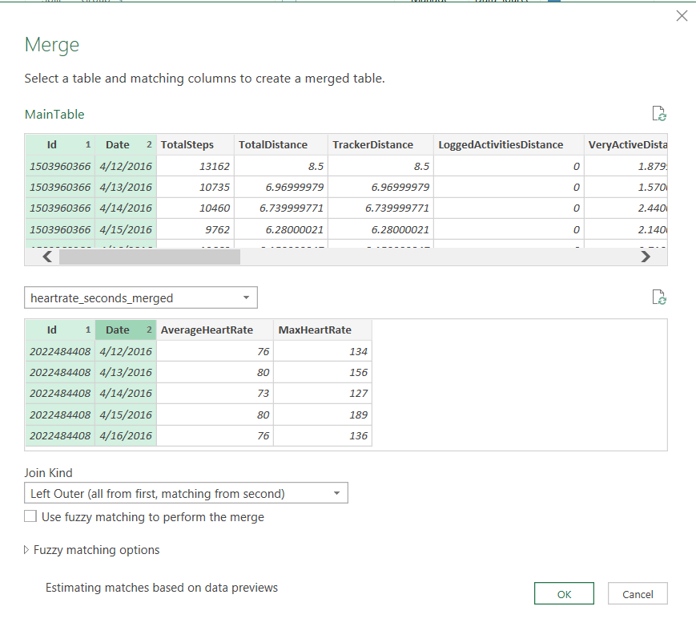
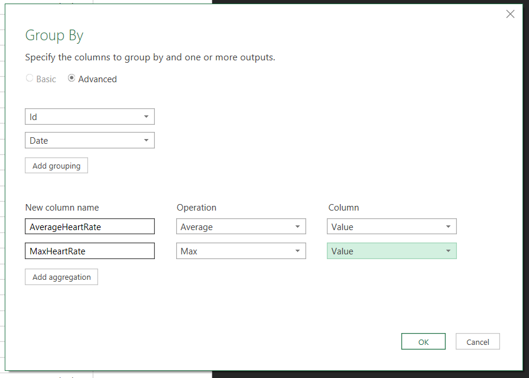
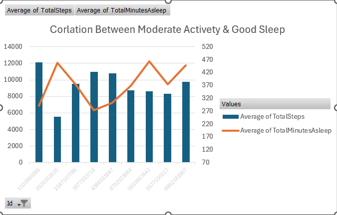
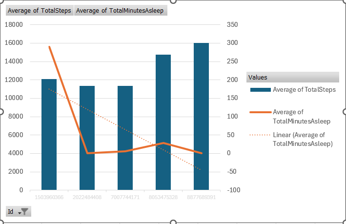

# Bellabeat Health Tracker Case Study (Capstone Project)

## Project Overview
This project analyzes smart device fitness data from Fitbit users to identify growth opportunities for Bellabeat, a high-tech manufacturer of health-focused products for women. 

## Business Task
Analyze smart device usage data to understand how consumers use non-Bellabeat smart devices and apply these insights to guide marketing strategy for one Bellabeat product.

## Data Source
* **Dataset:** FitBit Fitness Tracker Data (CC0: Public Domain, available on Kaggle).
* **Content:** Personal tracker data from thirty fitbit users, including minute-level output for physical activity, heart rate, and sleep monitoring.

## Tools Used
* **Microsoft Excel:** Data cleaning, formatting, Pivot Tables, and chart visualizations.
  
  
  

### Key Insights & Visualizations

#### 1. The "Sweet Spot" for Sleep Quality (Activity vs. Sleep Analysis)
* **Finding:** There is a non-linear relationship between daily physical activity and sleep quality. 
* **The "Sweet Spot":** Users who maintained **moderate daily step counts** experienced the highest quality and most consistent sleep.
* **The Extremes:** 
  * **Sedentary Users:** Users with very low step counts struggled with poor sleep efficiency and spent more time awake in bed.
  * **Over-Exerted Users:** Interestingly, high-intensity workouts or excessive step counts also correlated with a dip in sleep quality, likely due to over-exertion or late-night training.

*Figure 1: Excel Pivot Chart showing the correlation between daily step intervals and average minutes asleep.*

*Figur 2: Excel Pivot Chart showing the correlation between low step counts and poor sleep.*

## Strategic Recommendations for Bellabeat

Based on the insight that user sleep quality peaks at moderate activity levels and drops during extreme behaviors (sedentary lifestyle or over-exertion), Bellabeat should implement the following data-driven product and marketing strategies:

### 1. Introduce a "Sleep & Activity Sweet Spot" Feature
* **Action:** Program the Bellabeat app to calculate a personalized daily step target for each user based on their historical sleep data. 
* **Impact:** Instead of pushing a generic 10,000-step goal, the app will guide users toward their specific "sweet spot" activity level to maximize restorative rest.

### 2. Smart Alerts for "Over-Exertion" and "Inactivity"
* **Action:** Use real-time data to send push notifications. 
  * If a user is highly sedentary, trigger a gentle reminder to move to prevent poor sleep.
  * If a user is approaching excessive workout thresholds late in the day, send a "Wind Down" alert suggesting yoga or meditation instead of intense exercise.

### 3. Marketing Campaign: "Balance for Women's Wellness"
* **Action:** Shift marketing narratives away from extreme fitness and toward holistic, balanced health. 
* **Impact:** Position Bellabeat as a mindful companion that helps busy women prevent burnout, emphasizing that rest is just as productive as a workout.

